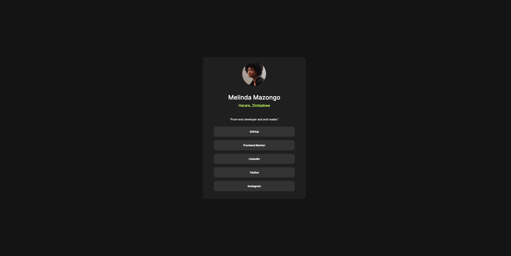

# Frontend Mentor - Social links profile solution

This is a solution to the [Social links profile challenge on Frontend Mentor](https://www.frontendmentor.io/challenges/social-links-profile-UG32l9m6dQ). Frontend Mentor challenges help you improve your coding skills by building realistic projects. 

## Table of contents

- [Overview](#overview)
  - [The challenge](#the-challenge)
  - [Screenshot](#screenshot)
  - [Links](#links)
- [My process](#my-process)
  - [Built with](#built-with)
  - [What I learned](#what-i-learned)
  - [Continued development](#continued-development)
  - [Useful resources](#useful-resources)


## Overview

### The challenge

Users should be able to:

- See hover and focus states for all interactive elements on the page

### Screenshot📷
***Desktop View***

***Mobile View***


### Links🔗

- Solution URL: [Source Code](https://github.com/ownedbyanonymous/social-links-profile-main)
- Live Site URL: [Live site](https://social-links-profile-main-amber.vercel.app/)

## My process

### Built with🧰

- Semantic HTML5 markup
- CSS
- Flexbox

### What I learned📖

The main lesson from this project was using  CSS media queries. The media queries allow for the creation of responsive designs on different screens. In this case, it was changing the width of the social media card, on smaller devices it takes almost all the real estate width whereas on larger devices the width id reduced significantly.

To see how you can add code snippets, see below:

```css
/* 
This is the simplest media query syntax.
The media-type can be all, print or screen and is optional
The media feature rule is the rule that should be satisfied for the CSS rules to be applied.
*/
@media media-type and (media-feature-rule){
  /* CSS Rules */
}
```

### Continued development📖

I have grapsed the CSS media-query topic and flexbox but more practice is still needed in order to fully engrave the concepts in my brain.


### Useful resources📚

- [Resource 1](https://developer.mozilla.org/en-US/docs/Learn/CSS/CSS_layout/Media_queries#more_complex_media_queries) - This helped me understand media queries and how to use them for responsive designs.


## Author✍🏾

- Frontend Mentor - [@ownedbyanonymous](https://www.frontendmentor.io/profile/ownedbyanonymous)
